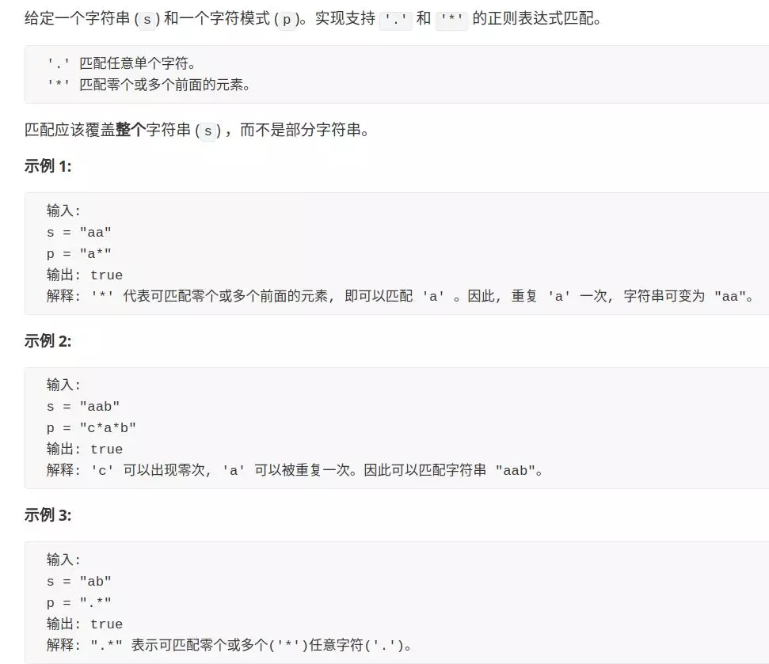
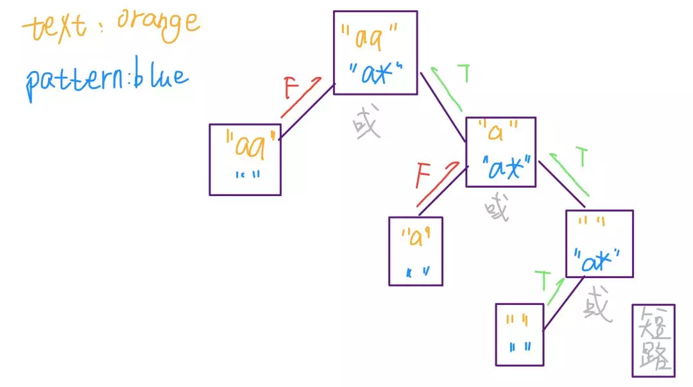

# 动态规划之正则表达

之前的文章「动态规划详解」收到了普遍的好评，今天写一个动态规划的实际应用：正则表达式。如果有读者对「动态规划」还不了解，建议先看一下上面那篇文章。

正则表达式匹配是一个很精妙的算法，而且难度也不小。本文主要写两个正则符号的算法实现：点号「.」和星号「*」，如果你用过正则表达式，应该明白他们的用法，不明白也没关系，等会会介绍。文章的最后，介绍了一种快速看出重叠子问题的技巧。

本文还有一个重要目的，就是教会读者如何设计算法。我们平时看别人的解法，直接看到一个面面俱到的完整答案，总觉得无法理解，以至觉得问题太难，自己太菜。我力求向读者展示，算法的设计是一个螺旋上升、逐步求精的过程，绝不是一步到位就能写出正确算法。本文会带你解决这个较为复杂的问题，让你明白如何化繁为简，逐个击破，从最简单的框架搭建出最终的答案。

前文无数次强调的框架思维，就是在这种设计过程中逐步培养的。下面进入正题，首先看一下题目：



### 一、热身

第一步，我们暂时不管正则符号，如果是两个普通的字符串进行比较，如何进行匹配？我想这个算法应该谁都会写：

```cpp
bool isMatch(string text, string pattern) {
    if (text.size() != pattern.size()) 
        return false;
    for (int j = 0; j < pattern.size(); j++) {
        if (pattern[j] != text[j])
            return false;
    }
    return true;
}
```

然后，我稍微改造一下上面的代码，略微复杂了一点，但意思还是一样的，很容易理解吧：

```cpp
bool isMatch(string text, string pattern) {
    int i = 0; // text 的索引位置
    int j = 0; // pattern 的索引位置
    while (j < pattern.size()) {
        if (i >= text.size()) 
            return false;
        if (pattern[j++] != text[i++])
            return false;
    }
    // 相等则说明完成匹配
    return j == text.size();
}
```
如上改写，是为了将这个算法改造成递归算法（伪码）:
```python
def isMatch(text, pattern) -> bool:
    if pattern is empty: return (text is empty?)
    first_match = (text not empty) and pattern[0] == text[0]
    return first_match and isMatch(text[1:], pattern[1:])
```

对应C++代码如下：
```cpp
bool isMatch(string text, string pattern)
{
	if (0 == pattern.size())
		return 0 == text.size() ? true : false;
	bool first_match = false;
	first_match = ((0 != text.size()) && pattern[0]==text[0]);
	return first_match && isMatch(text.substr(1), pattern.substr(1));
}
```

如果你能够理解这段代码，恭喜你，你的递归思想已经到位，正则表达式算法虽然有点复杂，其实是基于这段递归代码逐步改造而成的。

### 二、处理点号「.」通配符

点号可以匹配任意一个字符，万金油嘛，其实是最简单的，稍加改造即可：

```python
def isMatch(text, pattern) -> bool:
    if not pattern: return not text
    first_match = bool(text) and pattern[0] in {text[0], '.'}
    return first_match and isMatch(text[1:], pattern[1:])
```
`pattern[0] in {text[0], '.'} pattern[0] 在不在{text[0], '.'}` 组成的序列里
如果 `pattern[0] 为'.'`，那么它一定为true,这样就可以匹配到任意单个字符了,C++实现如下：
```cpp
string temp = {text[0], '.'};
first_match = ((0 != text.size()) && std::string::npos != temp.find(pattern[0]));
```

```cpp
bool isMatch(string text, string pattern)
{
	if(0 == pattern.size())
		return 0 == text.size() ? true : false;

	bool first_match = false;
    //这里也可以不创建新的string
    first_match = ((0 != text.size()) && (pattern[0] == text[0] || pattern[0] == '.'));
	return first_match && isMatch(text.substr(1), pattern.substr(1));
}
```

### 三、处理「*」通配符

星号通配符可以让前一个字符重复任意次数，包括零次。那到底是重复几次呢？这似乎有点困难，不过不要着急，我们起码可以把框架的搭建再进一步：

```python
def isMatch(text, pattern) -> bool:
    if not pattern: return not text
    first_match = bool(text) and pattern[0] in {text[0], '.'}
    if len(pattern) >= 2 and pattern[1] == '*':
        # 发现 '*' 通配符
    else:
        return first_match and isMatch(text[1:], pattern[1:])
```

星号前面的那个字符到底要重复几次呢？这需要计算机暴力穷举来算，假设重复 N 次吧。前文多次强调过，写递归的技巧是管好当下，之后的事抛给递归。具体到这里，不管 N 是多少，当前的选择只有两个：匹配 0 次、匹配 1 次。所以可以这样处理：

```python
if len(pattern) >= 2 and pattern[1] == '*':
    return isMatch(text, pattern[2:]) or \
            first_match and isMatch(text[1:], pattern)
# 解释：如果发现有字符和 '*' 结合，
    # 或者匹配该字符 0 次，然后跳过该字符和 '*'
    # 或者当 pattern[0] 和 text[0] 匹配后，移动 text
```
可以看到，我们是通过保留 pattern 中的「\*」，同时向后推移 text，来实现「*」将字符重复匹配多次的功能。举个简单的例子就能理解这个逻辑了。假设 `pattern = a*`, `text = aaa`，画个图看看匹配过程：


相应的C++版本：
```cpp
bool isMatch(string text, string pattern)
{
	if (0 == pattern.size() && 0 == text.size())
		return true;

	if (0 == pattern.size() && 0 != text.size())
		return false;

	bool first_match = false;
	first_match = ((0 != text.size()) && (pattern[0] == text[0] || pattern[0] == '.'));
	if (pattern.length() >= 2 && '*' == pattern[1])
	{
		// 发现'*'通配符
		return isMatch(text, pattern.substr(2)) || (first_match && isMatch(text.substr(1), pattern));
	}
	else
	{
		return first_match && isMatch(text.substr(1), pattern.substr(1));
	}
}
```
至此，正则表达式算法就基本完成了，

### 四、动态规划

我选择使用「备忘录」递归的方法来降低复杂度。有了暴力解法，优化的过程及其简单，就是使用两个变量 i, j 记录当前匹配到的位置，从而避免使用子字符串切片，并且将 i, j 存入备忘录，避免重复计算即可。

我将暴力解法和优化解法放在一起，方便你对比，你可以发现优化解法无非就是把暴力解法「翻译」了一遍，加了个 memo 作为备忘录，仅此而已。

```python
# 带备忘录的递归
def isMatch(text, pattern) -> bool:
    memo = dict() # 备忘录
    def dp(i, j):
        if (i, j) in memo: return memo[(i, j)]
        if j == len(pattern): return i == len(text)

        first = i < len(text) and pattern[j] in {text[i], '.'}
        
        if j <= len(pattern) - 2 and pattern[j + 1] == '*':
            ans = dp(i, j + 2) or \
                    first and dp(i + 1, j)
        else:
            ans = first and dp(i + 1, j + 1)
            
        memo[(i, j)] = ans
        return ans
    
    return dp(0, 0)

# 暴力递归
def isMatch(text, pattern) -> bool:
    if not pattern: return not text

    first = bool(text) and pattern[0] in {text[0], '.'}

    if len(pattern) >= 2 and pattern[1] == '*':
        return isMatch(text, pattern[2:]) or \
                first and isMatch(text[1:], pattern)
    else:
        return first and isMatch(text[1:], pattern[1:])
```
对应的`C++`版本,`C++`版本需要注意的是：定义了三个类的成员变量`vector<vector<bool> > mem; string text; string pattern;` 而不是做成函数传参，为什么呢？因为做成函数传参会消耗较多的内存，这是一个递归调用，将vector数组作为函数的参数递归调用，会造成许多无用的拷贝，复制参数的过程；最后提交还会超时错误；
```cpp
class Solution {
public:
	bool isMatch(string text, string pattern)
	{
		if (0 == pattern.size())
			return 0 == text.size() ? true : false;
            
		// 初始化一个备忘录，二维数组，大小为(m+1)*(n+1)
		int m = text.size(), n = pattern.size();
		// m 为text的长度 n为pattern的长度
		mem.resize(m + 1);
		// 这个才能mem[i] resize才能正常
		for (int i = 0; i < mem.size(); i++)
		{
			mem[i].resize(n + 1);
			for (bool flag : mem[i])
			{
				flag = false;
			}
		}
		this->text = text;
		this->pattern = pattern;

		return helper(0, 0);
	}

	bool helper(int i, int j)
	{
		if (mem[i][j])
			return mem[i][j];
		if (j == pattern.size())
			return i == text.size();

		bool first_match = false;
		first_match = ((i < text.size()) && (pattern[j] == text[i] || pattern[j] == '.'));
		bool ans = false;
		if (j <= pattern.size() - 2 && '*' == pattern[j + 1])
		{
			// 发现'*'通配符
			bool a = helper(i, j + 2);
			bool b = first_match && helper(i + 1, j);
			ans = a || b;
		}
		else
		{
			ans = first_match && helper(i + 1, j + 1);
		}
		mem[i][j] = ans;
		return ans;
	}

private:
	vector<vector<bool> > mem;
	string text;
	string pattern;
};
```

这里再放一下从低而上的迭代算法，说实话，这个真正的迭代算法如下，但是first_match比较难以理解：不同的分支不同算法，没理解
```CPP
class Solution {
public:
    bool isMatch(string s, string p)
    {
        int m = s.size(), n = p.size();
        vector<vector<bool>> dp(m + 1, vector<bool>(n + 1, false));
        dp[0][0] = true;
        bool first_match = false;
        for (int i = 0; i <= m; ++i)
        {
            for (int j = 1; j <= n; ++j)
            {
                if (j > 1 && p[j - 1] == '*')
                {
                    first_match = i > 0 && (s[i - 1] == p[j - 2] || p[j - 2] == '.');
                    dp[i][j] = dp[i][j - 2] || (first_match && dp[i - 1][j]);
                }
                else
                {
                    // first_match = i > 0 && (s[i - 1] == p[j - 1] || p[j - 1] == '.');
                    // i > 0 必须放在前面，否则i-1可能会越界
                    dp[i][j] =  i > 0 && dp[i - 1][j - 1] && (s[i - 1] == p[j - 1] || p[j - 1] == '.');
                }
            }
        }
        return dp[m][n];
    }
};
```
迭代算法，但是实际上还是自顶而下的迭代算法,leetcode题解看到的如下：
```cpp
class Solution {
public:
    bool isMatch(string text, string pattern) {
        int m = text.size(), n = pattern.size();
        vector<vector<bool>> dp(m + 1, vector<bool>(n + 1, false));
        dp[m][n] = true;

        for (int i = text.size(); i >= 0; i--){
            for (int j = pattern.size()- 1; j >= 0; j--){
                bool first_match = (i < text.length() &&
                                       (pattern[j] == text[i] ||
                                        pattern[j] == '.'));
                if (j + 1 < pattern.size() && pattern[j+1] == '*'){
                    dp[i][j] = dp[i][j+2] || first_match && dp[i+1][j];
                } else {
                    dp[i][j] = first_match && dp[i+1][j+1];
                }
            }
        }
        return dp[0][0];
    }
};
```
**有的读者也许会问，你怎么知道这个问题是个动态规划问题呢，你怎么知道它就存在「重叠子问题」呢，这似乎不容易看出来呀？**

解答这个问题，最直观的应该是随便假设一个输入，然后画递归树，肯定是可以发现相同节点的。这属于定量分析，其实不用这么麻烦，下面我来教你定性分析，一眼就能看出「重叠子问题」性质。

先拿最简单的斐波那契数列举例，我们抽象出递归算法的框架：

```python
def fib(n):
    fib(n - 1) #1
    fib(n - 2) #2
```

看着这个框架，请问原问题 f(n) 如何触达子问题 f(n - 2) ？有两种路径，一是 f(n) -> #1 -> #1, 二是 f(n) -> #2。前者经过两次递归，后者进过一次递归而已。两条不同的计算路径都到达了同一个问题，这就是「重叠子问题」，而且可以肯定的是，**只要你发现一条重复路径，这样的重复路径一定存在千万条，意味着巨量子问题重叠。**

同理，对于本问题，我们依然先抽象出算法框架：

```python
def dp(i, j):
    dp(i, j + 2)     #1
    dp(i + 1, j)     #2
    dp(i + 1, j + 1) #3
```

提出类似的问题，请问如何从原问题 dp(i, j) 触达子问题 dp(i + 2, j + 2) ？至少有两种路径，一是 dp(i, j) -> #3 -> #3，二是 dp(i, j) -> #1 -> #2 -> #2。因此，本问题一定存在重叠子问题，一定需要动态规划的优化技巧来处理。

### 五、最后总结

通过本文，你深入理解了正则表达式的两种常用通配符的算法实现。其实点号「.」的实现及其简单，关键是星号「*」的实现需要用到动态规划技巧，稍微复杂些，但是也架不住我们对问题的层层拆解，逐个击破。另外，你掌握了一种快速分析「重叠子问题」性质的技巧，可以快速判断一个问题是否可以使用动态规划套路解决。

回顾整个解题过程，你应该能够体会到算法设计的流程：从简单的类似问题入手，给基本的框架逐渐组装新的逻辑，最终成为一个比较复杂、精巧的算法。所以说，读者不必畏惧一些比较复杂的算法问题，多思考多类比，再高大上的算法在你眼里也不过一个脆皮。

如果本文对你有帮助，欢迎关注我的公众号 labuladong，致力于把算法问题讲清楚～

