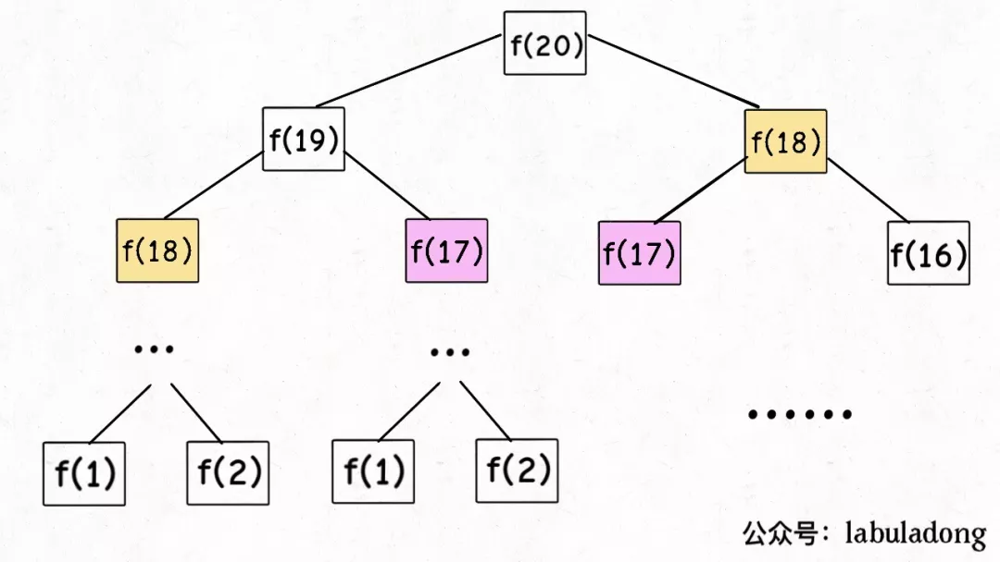
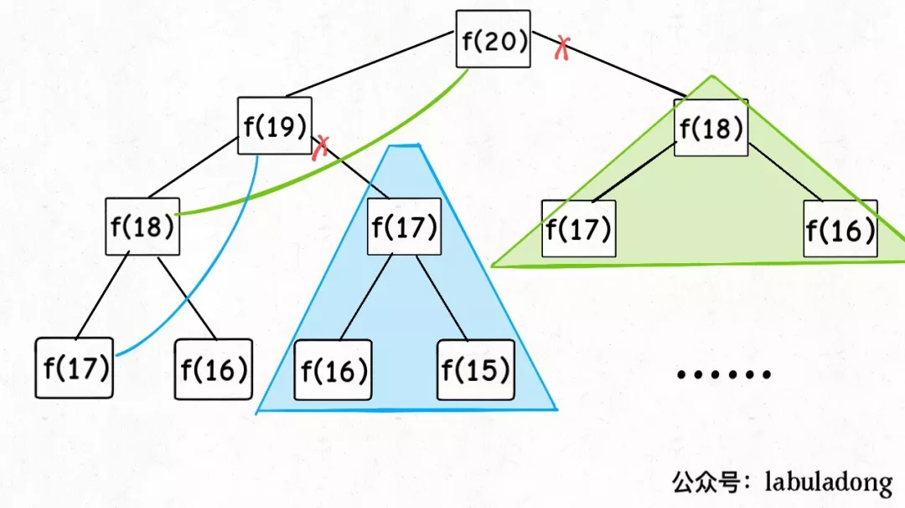
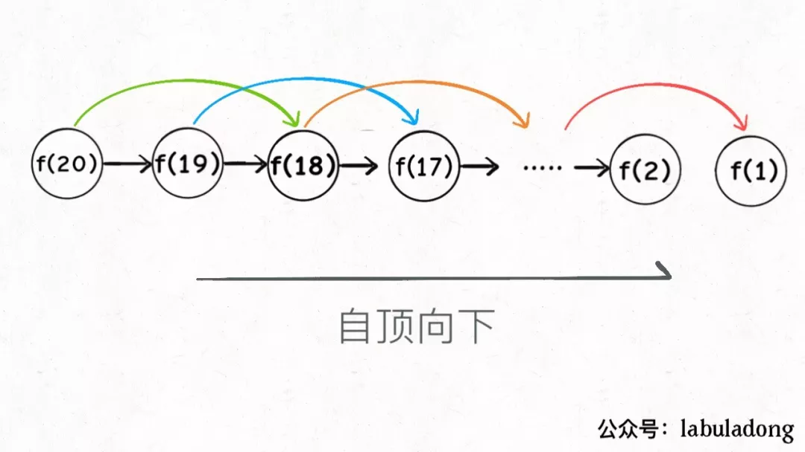
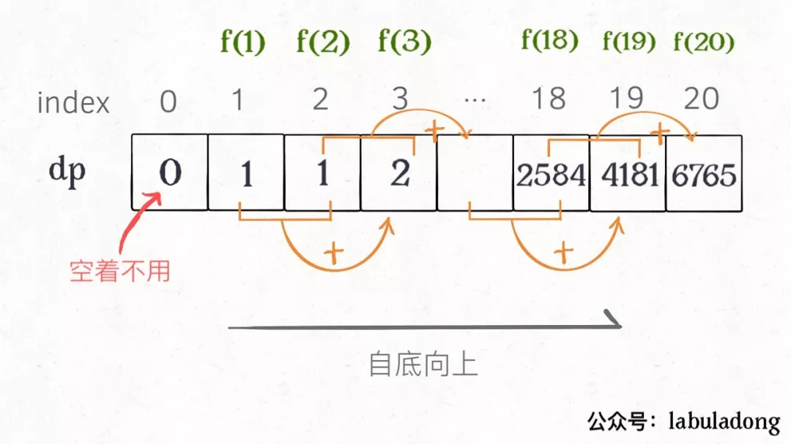
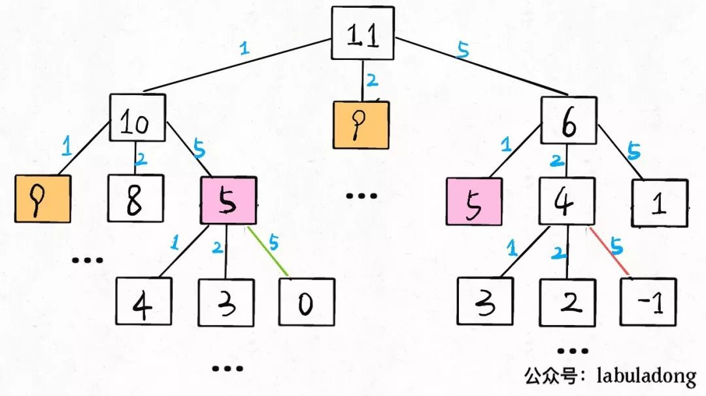

本文转自公众号labuladong，发现作者在csdn也有账号，贴上原文链接https://blog.csdn.net/fdl123456/article/details/103359920
下面增加了部分自己的理解，这里做个记录；

#### 动态规划
动态规划问题的一般形式就是求最值。动态规划其实是运筹学的一种最优化方法，只不过在计算机问题上应用比较多，比如说让你求最长递增子序列呀，最小编辑距离呀等等。

1. 动态规划的穷举有特殊之处，这类问题存在[重叠子问题]，如果包里穷举的话效率极其低下，所以需要[备忘录]或者[DP table]来优化穷举过程，避免不必要的计算。

2. 而且，动态规划问题一定会具备[最优子结构]，才能通过子问题的最值得到原问题的最值；

3. 问题千变万化，穷举所有可行解并不是一件容易的事，只有列出正确的[状态转移方程]才能正确穷举。

上面提到的**<Font color=red>重叠子问题，最优子结构，状态转移方程</font>**就是动态规划的三要素。

写出状态转移方程式最困难的，怎么去写：

**明确[状态] -> 定义dp数组/函数的含义-> 明确[选择]->明确basecase**


### 一. 斐波那契数列  目的：明白什么是重叠子问题
#### 1. 暴力递归
```
int fib(int n)
{
	if(n==1 || n==2)
		return 1;
	else
		return fib(n-1)+fib(n-2);
}
```
但凡遇到需要递归的问题，最好都画出递归树，这对你分析算法的复杂度，寻找算法低效的原因都有巨大的帮助；



递归算法的时间复杂度怎么计算？**子问题个数乘以解决一个子问题需要的时间**。


子问题的个数，节点总数为指数级别，所以子问题的个数为0(2^n);
解决一个子问题的时间，本算法中，没有循环，只有f(n-1)+f(n-2),一个加法操作，时间为o(1);
所以这个算法的时间复杂度为o(2^n)，指数级别，爆炸；

观察递归树，很明显发现了算法低效的原因：存在大量重复计算，比如f(18)被计算了两次，而且你可以看到，以f(18)为根的这个递归树体量巨大，多算一遍，会耗费巨大的时间。更何况，还不止f(18)这一个节点被重复计算，所以这个算法极其低效。

这就是动态规划问题的第一个性质：重叠子问题。下面，我们想办法解决这个问题。

#### 2. 带备忘录的递归解法
明确了问题，其实就已经把问题解决了一半。即然耗时的原因是重复计算，那么我们可以造一个「备忘录」，每次算出某个子问题的答案后别急着返回，先记到「备忘录」里再返回；每次遇到一个子问题先去「备忘录」里查一查，如果发现之前已经解决过这个问题了，直接把答案拿出来用，不要再耗时去计算了。

一般使用一个数组充当这个「备忘录」，当然你也可以使用哈希表（字典），思想都是一样的。

一维数组，放在C++，对应是vector<>;

```
int fib(int n)
{
    if(n < 1)
        return 0;
    vector<int> memo(n+1, 0);
    return helper(memo, n);
}

int helper(vector<int> &memo, int n)
{
    //base case
    if(n==1 || n==2)
        return 1;
    if(memo[n]!=0) return memo[n];
    memo[n] = helper(memo, n-1) + helper(memo, n-2); 
    return memo[n];
}
```
备忘录做了什么：


实际上，带「备忘录」的递归算法，把一棵存在巨量冗余的递归树通过「剪枝」，改造成了一幅不存在冗余的递归图，极大减少了子问题（即递归图中节点）的个数。



递归算法的时间复杂度怎么算？子问题个数乘以解决一个子问题需要的时间。

子问题个数，即图中节点的总数，由于本算法不存在冗余计算，子问题就是f(1),f(2),f(3)…f(20)，数量和输入规模 n = 20 成正比，所以子问题个数为 O(n)。

解决一个子问题的时间，同上，没有什么循环，时间为 O(1)。

所以，本算法的时间复杂度是 O(n)。比起暴力算法，是降维打击。

**啥叫「自顶向下」？**注意我们刚才画的递归树（或者说图），是从上向下延伸，都是从一个规模较大的原问题比如说f(20)，向下逐渐分解规模，直到f(1)和f(2)触底，然后逐层返回答案，这就叫「自顶向下」。

**啥叫「自底向上」？**反过来，我们直接从最底下，最简单，问题规模最小的f(1)和f(2)开始往上推，直到推到我们想要的答案f(20)，这就是动态规划的思路，这也是为什么动态规划一般都脱离了递归，而是由循环迭代完成计算

#### 3. dp数组的迭代解法

有了上一步[备忘录]的启发，我们可以把这个[备忘录]独立出来成为一张表，就叫做DP table吧，在这张表上完成[自底向上]的推算；

```
int fib(int n)
{
	vector<int> dp(n+1, 0);
    //basecase
    dp[1] = dp[2] = 1;
    for(int i =3; i <= N; i++)
    {
    	dp[i] = dp[i-1] + dp[i-2];
    }
    return dp[n];
}
```



其实这是个迭代算法，DP table 也像之前[剪枝]后的结果，只是反过来算而已；效率也都基本相同。

这里，引出**[状态转移方程]这个名词，实际上就是描述问题结构的数学形式**：

$f(n)=\left\{\begin{array}{l}1, n=1,2 \\ f(n-1)+f(n-2), n>2\end{array}\right.$

为啥叫[状态转移方程]？为了听起来高端。**f[n]想做一个状态n，这个状态n是由状态n-1和状态n-2相加转移而来，则就叫状态转移，仅此而已**。

根据斐波那契数列的状态转移方程（函数），当前状态只和之前的两个状态有关，其实并不需要那么长的一个dptable来存储所有的状态；只要保存前两个状态就行了；这就可以进一步优化，空间复杂度降到o(1);

```
int fib(int n)
{
	if(n==2||n==1)
    {
        return 1;
    }
    int cur = 1,pre = 1;
    
    for(int i =3; i <= N; i++)
    {
    	int sum = cur + pre;
        pre = cur;
        cur = sum;
    }
    return cur;
}
```

### 二.凑零钱问题

先看下题目：给你`k`种面值的硬币，面值分别为`c1, c2 ... ck`，每种硬币的数量无限，再给一个总金额`amount`，问你最少需要几枚硬币凑出这个金额，如果不可能凑出，算法返回 -1 。算法的函数签名如下：

```
// coins 中是可选硬币面值，amount 是目标金额
int coinChange(int[] coins, int amount);
```

比如说k = 3，面值分别为 1，2，5，总金额amount = 11。那么最少需要 3 枚硬币凑出，即 11 = 5 + 5 + 1。

你认为计算机应该如何解决这个问题？显然，就是把所有可能的凑硬币方法都穷举出来，然后找找看最少需要多少枚硬币。

动态规划问题，因为它具有[最优子结构]。要符合[最优子结构]，子问题间必须相互独立。
啥叫相互独立？ 比如我想求`amount=11`时的最少硬币数(原问题)； 如果你知道凑出`amount=10`的最小硬币数（子问题），你只需要把子问题的答案加一（再选一枚面值为1的硬币）就是原问题的答案，因为硬币的数量是没有限制的，子问题之间也没有相互制约，是相互独立的。

这样的话，我是要选coin里最小的一个硬币数值`coin_min`，然后求`amount-coin_min`的最小硬币数，然后+1，然后`amount-coin_min`再选一个最小硬币，然后数量+1； 一个硬币有说用几次的限制么，没有，每种硬币的数量无限；你也可以找`coin_max`最大的，求`amount-coin_max`的最大硬币数； 然后数量+1，这个方式前提是：`amount>coin_max`;这就引出关键问题，amount可以减去任意的coin值，最终求amount-coin_k 的硬币数，然后+1的得到结果，这样就最终的amount需要的硬币数，是这些dp[amount-coin_k] +1 的最小值;

我们用符号总结下： n 总金额，dp(n)代表 组成这个n金额需要的硬币数，c1..ck 为可选的硬币种类

`dp(n) = min(1+dp(n-c1), 1+dp(n-c2),...,1+dp(n-ck));`

根据套路：明确「状态」 -> 定义 dp 数组/函数的含义 -> 明确「选择」-> 明确 base case，我们再来总结下：

**先确定「状态」，也就是原问题和子问题中变化的变量**。由于硬币数量无限，所以唯一的**状态**就是目标金额amount。 (这里的变量这就是状态)

**然后确定dp函数的定义**：函数 dp(n)表示，当前的目标金额是n，至少需要dp(n)个硬币凑出该金额。

**然后确定「选择」并择优，**也就是对于每个状态，可以做出什么选择改变当前状态。具体到这个问题，无论当的目标金额是多少，选择就是从面额列表coins中选择一个硬币，然后目标金额就会减少：
**明确basecase**：
a. 目标金额为0，dp(0)=0;
b. 当目标金额小于0，返回-1；
c. 当可选硬币面值最小的cmin > n, 则dp(n)=-1;（可以删除）
><font color=red>这有一个问题：第三个条件需要么？ </font>
如果你考虑递归，每次`dp[n-ck]`，如果ck>n，则`n-ck<0`;那么这里就和第二个basecase重合了；也就没有考虑的必要了；

最终的状态转移方程：
$dp(n)=\left\{\begin{array}{l}0, n=0 \\ -1, n<0 \\ \min \{dp(n-\operatorname{coin})+1 | \operatorname{coin} \in \operatorname{coin} s\}, n>0\end{array}\right.$

#### 1. 暴力递归解法

知道了状态转移方程，这个递归就显而易见了，上代码：
```
// coins 中是可选硬币面值，amount 是目标金额
int coinChange(const vector<int> coins, int amount)
{
	// 明确base case
	if (0 == coins.size() || amount < 0)
	{
		return -1;
	}
	if (0 == amount)
	{
		return 0;
	}
    int res = INT_MAX;
	for (int i : coins)
	{
		int sub_problem = coinChange_digui(coins, amount - i);
		if (-1 != sub_problem)
			res = std::min(res, 1 + sub_problem);
	}
	return res;
}
```
至此，这个问题其实就解决了，只不过需要消除一下重叠子问题，比如`amount = 11, coins = {1,2,5}`时画出递归树看看：



**时间复杂度分析：子问题总数 x 解决每个子问题的时间。**

子问题总数为递归树节点个数，这个比较难看出来，是 O(n^k)，总之是指数级别的。每个子问题中含有一个 for 循环，复杂度为 O(k)。所以总时间复杂度为 O(k * n^k)，指数级别。

2. 通过备忘录消除重复计算的子问题

```
int help(vector<int> coins, int amount, vector<int> & mem);
// coins 中是可选硬币面值，amount 是目标金额
int coinChange(vector<int> coins, int amount)
{
	int res = INT_MAX;
	vector<int> mem = vector<int>(amount+1, 0);

	return help(coins, amount, mem);
}

int help(vector<int> coins, int amount, vector<int> & mem)
{
	// 明确base case
	if (0 == coins.size() || amount < 0)
	{
		return -1;
	}
	if (0 == amount)
	{
		return 0;
	}

	if (0 != mem[amount])
		return mem[amount];

	int res = INT_MAX;
	for (int i : coins)
	{
		int sub_problem = help(coins, amount - i, mem);
		if(-1 != sub_problem)
			res = std::min(res, 1 + sub_problem);
	}
	mem[amount] = res;
	return res;
}
```
#### 3. dp 数组的迭代解法

当然，我们也可以自底向上使用 `dp table` 来消除重叠子问题，dp数组的定义和刚才dp函数类似，定义也是一样的：
```
int coinChange(vector<int> coins, int amount)
{
	// 数组大小为 amount + 1，初始值也为INT_MAX ，这里也阔以初始化为amount + 1
	vector<int> dp = vector<int>(amount + 1, INT_MAX);

	// 明确base case
	if (0 == coins.size() || amount < 0)
	{
		return -1;
	}
	if (0 == amount)
	{
		return 0;
	}

	dp[0] = 0;

	for (int i = 1; i < dp.size(); i++)
	{
		// 内层的for 针对已确定的金额，进行求所有子问题+1的最小值
		int temp_min = INT_MAX;
		for (auto coin : coins)
		{
			if(i - coin >= 0)
				temp_min = std::min(temp_min, 1+ dp[i - coin]);
		}
		dp[i] = temp_min;
	}
	if (INT_MAX != dp[amount])
		return dp[amount];
	else
		return -1;
}
```

PS：为啥dp数组可以初始化为`amount + 1`呢，因为凑成amount金额的硬币数最多只可能等于amount（全用 1 元面值的硬币），所以初始化为`amount + 1`就相当于初始化为正无穷，便于后续取最小值。

### 三. 最后总结
第一个斐波那契数列的问题，解释了如何通过「备忘录」或者「dp table」的方法来优化递归树，并且明确了这两种方法本质上是一样的，只是自顶向下和自底向上的不同而已。

第二个凑零钱的问题，展示了如何流程化确定「状态转移方程」，只要通过状态转移方程写出暴力递归解，剩下的也就是优化递归树，消除重叠子问题而已。

如果你不太了解动态规划，还能看到这里，真得给你鼓掌，相信你已经掌握了这个算法的设计技巧。

计算机解决问题其实没有任何奇技淫巧，它唯一的解决办法就是穷举，穷举所有可能性。算法设计无非就是先思考“如何穷举”，然后再追求“如何聪明地穷举”。

列出动态转移方程，就是在解决“如何穷举”的问题。之所以说它难，一是因为很多穷举需要递归实现，二是因为有的问题本身的解空间复杂，不那么容易穷举完整。

备忘录、DP table 就是在追求“如何聪明地穷举”。用空间换时间的思路，是降低时间复杂度的不二法门，除此之外，试问，还能玩出啥花活？

