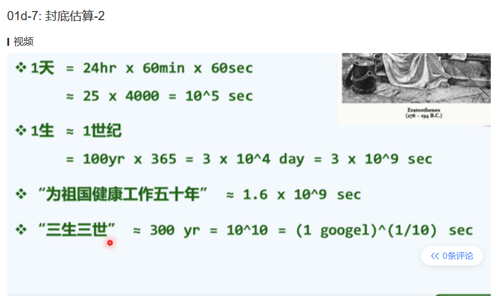
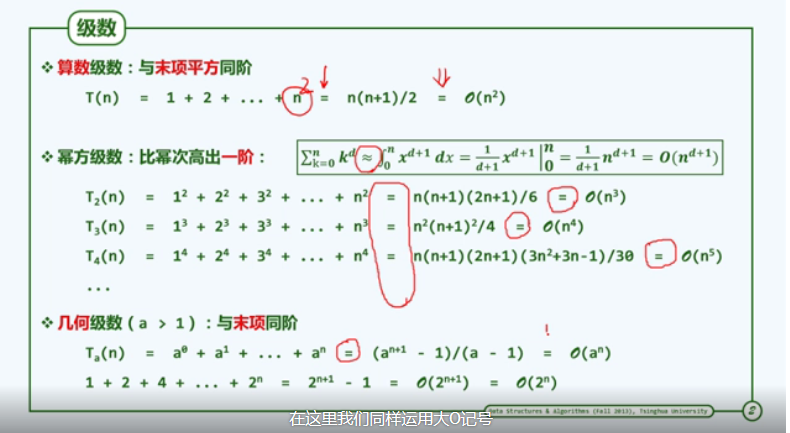
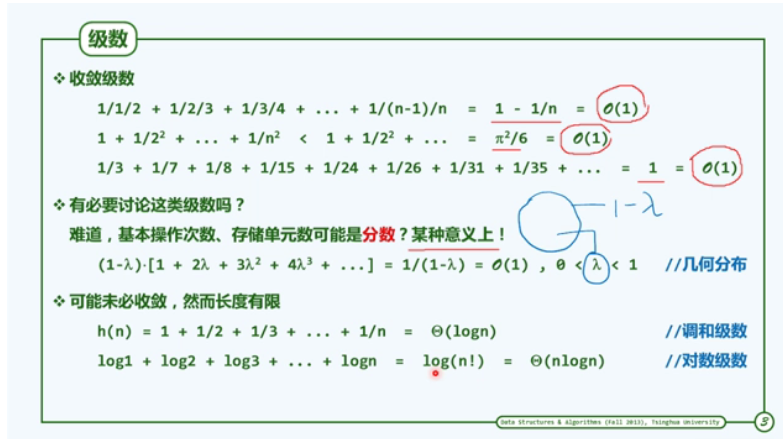

# 算法分析
## 封底估算

## 级数

# 迭代与递归

fib 二分搜索

 1 1 2 3 5 8 13 21 34

假设有序向量vector<int>的大小 n = fib(k)-1; 则可取mi = fib(k-1)-1;

于是，前，后子向量的长度分别为fib(k-1)-1; fib(k-2)-1;

插值查找(Interpolation Search)

(mi-0)/(7-0) = (7-2)/(23-2)
mi = 7*5/21  