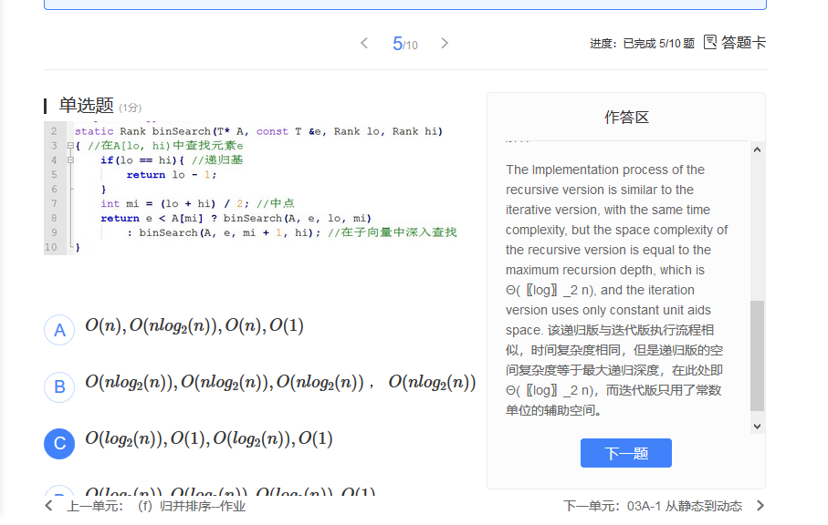

# 算法分析
## 封底估算

## 级数

# 迭代与递归
fib 二分搜索

 1 1 2 3 5 8 13 21 34

假设有序向量vector<int>的大小 n = fib(k)-1; 则可取mi = fib(k-1)-1;

于是，前，后子向量的长度分别为fib(k-1)-1; fib(k-2)-1;

插值查找(Interpolation Search)

(mi-0)/(7-0) = (7-2)/(23-2)
mi = 7*5/21  

递归版的空间复杂度等于最大递归深度

# 选择排序
选择排序 是 冒泡排序的优化？

选择排序，每次从未排序的元素中，选择一个最大的元素，头插法放到新的列表中
每次选择一个最大值，将它放置有序/无序列表的分界点；

冒泡排序，每次从头遍历，比较相邻两个元素，如果比前一个比它后一个大，则交换位置，直至排序到末尾

冒泡排序，每次遍历，比较次数o(n) 移动的次数o(n)

而选择排序，就是找未排序堆里最大的，然后移动到有序列表的头结点，只移动一次；比较o(n), 移动o(1)

对列表中起始于位置p的连续n个元素做选择排序 `vaild(p)` p合法 `rank(p)+n<size`  [p,p+n)

